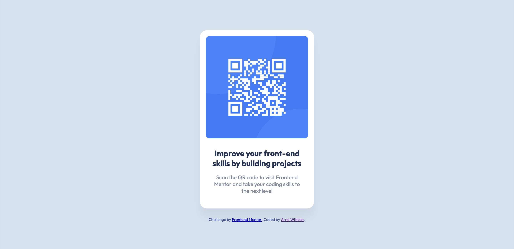

# Frontend Mentor - QR code component solution

This is my solution to the [QR code component challenge on Frontend Mentor](https://www.frontendmentor.io/challenges/qr-code-component-iux_sIO_H). It's a simple card layout that includes a QR code, heading, and descriptive text – great for practicing layout and typography with HTML & CSS.

## Table of contents

- [Overview](#overview)
  - [Screenshot](#screenshot)
  - [Links](#links)
- [My process](#my-process)
  - [Built with](#built-with)
  - [What I learned](#what-i-learned)

## Overview

### Screenshot



### Links

- Solution URL: [Frontend Mentor link](https://www.frontendmentor.io/solutions/responsive-qr-code-component-using-flexbox-and-css-variables-k62JR5igPu)
- Live Site URL: [Live demo](https://qr-code-component-xi-ten.vercel.app/)

## My process

### Built with

- Semantic HTML5
- CSS custom properties
- Flexbox
- Mobile-first workflow
- Visual alignment and spacing based on a provided design

### What I learned

This project helped me refresh the fundamentals of responsive layout with Flexbox. I also practiced:

- How to center elements both horizontally and vertically using Flexbox
- Using `box-sizing: border-box` to manage layout more predictably
- Applying mobile-first thinking (e.g. with `max-width` and `vw` units)
- Improving visual hierarchy with font weights and spacing

```css
body {
  display: flex;
  justify-content: center;
  align-items: center;
  height: 100vh;
}
```
